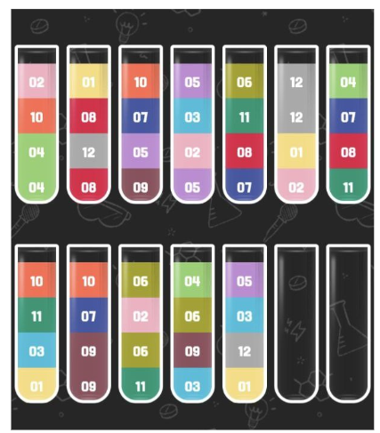
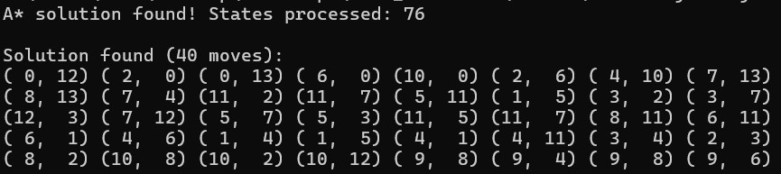

# Cортировка жидкостей

Алгоритм ищет последовательность переливаний, чтобы каждая бутылка стала либо пустой, либо заполненной одним цветом:

Сначала пробует жадный поиск: выбирает ход с наибольшей полезностью на текущем шаге.

Если жадный поиск не решает задачу, использует A* поиск: оценивает состояния через эвристику (штраф за разноцветные или неполные бутылки) и ищет минимальный путь к решению.

требуется **JDK 17**

находясь в директории task-1 выпонить:
```
cd bottles
gradlew build
java -jar build/libs/bottles-1.0-SNAPSHOT.jar
```

Предложит решение исходя из условия:



