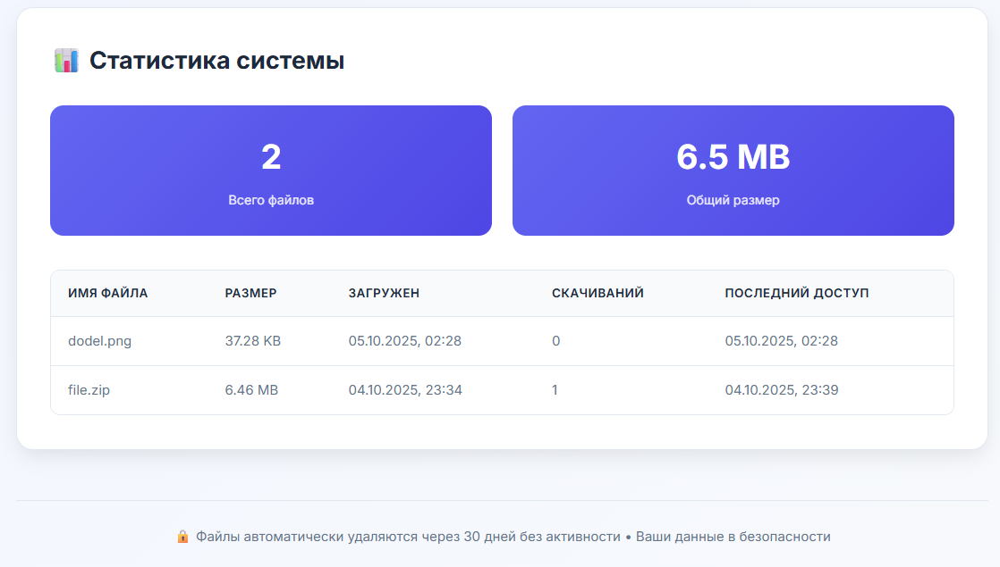

# Файловый сервер

Загрузка и скачивание файлов через браузер. Файлы хранятся в течение 30 дней.

Стек: Vanilla Java, Vanilla JS, CSS, HTML

требуется **JDK 17**

находясь в директории task-2 выпонить:
```
cd file-server
gradlew build
gradlew run
```

после запуска перейти по
`http://localhost:8080`

После загрузки файла сгенерируется уникальная ссылка на скачивание.



