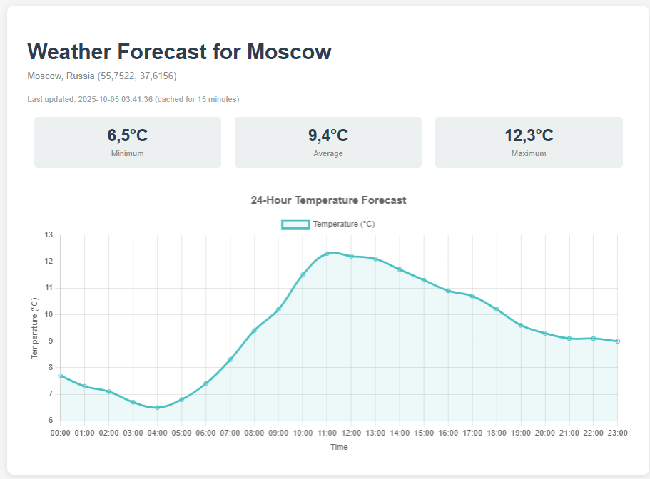

# Прогноз погоды

Вводя запрос `/weather?city={city}`, получаем прогноз погоды на сутки.

Стек: Vanilla Java

требуется **JDK 17**

находясь в директории task-3 выполнить:
```
cd weather-app
gradlew build
gradlew run
```

Результат по запросу `http://localhost:8080/weather?city=Moscow`


